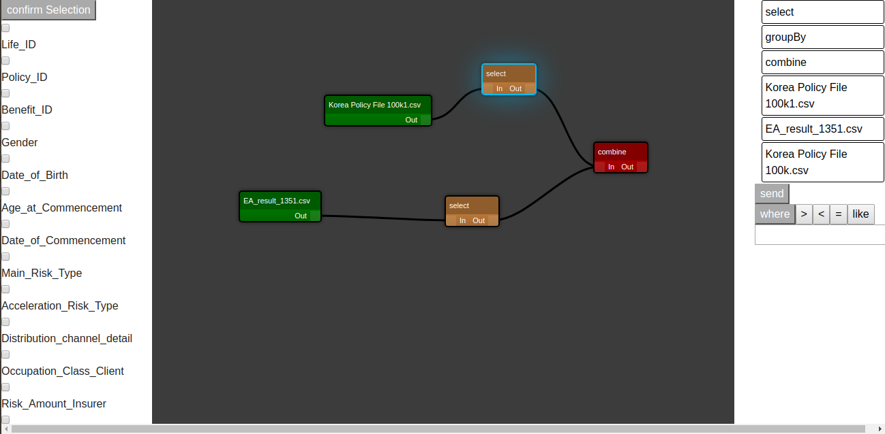
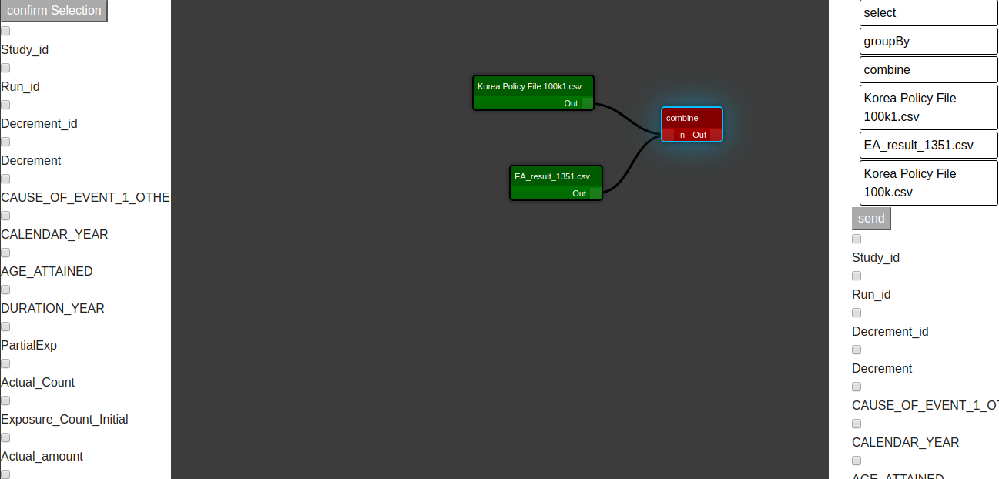

# hacktonpfe
Hack Ton Pfe

Ce projet est divisé sur deux parties:
frontend: développé avec react qui retourne un graphe acyclique, chaque noeud représente:
-un fichier
-une requete "select" ,"combine" ou bien "group by"
backend: développé avec spring boot en utlisant spark sql, contient un api et un parseur de graphe qui sert a order les taches à realiser et retourne le resultat.

ce qui marche:
-api
-le graphe acyclique ordonné.
-outil de construction de graphe qui contient select et combine.
-traitement des requetes
-retour des resultats

